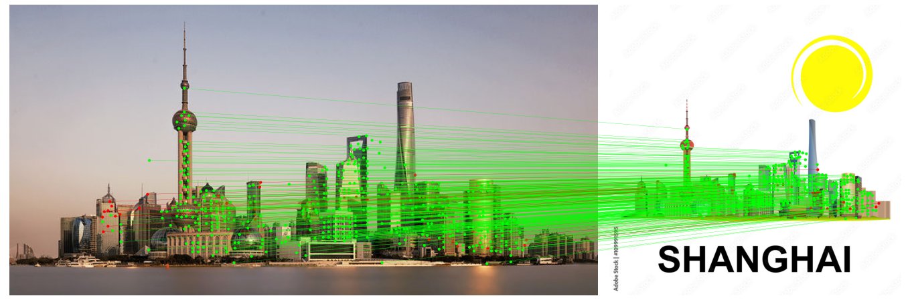
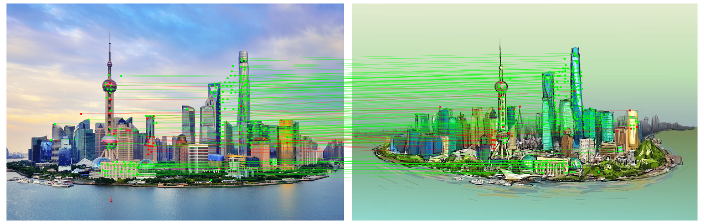
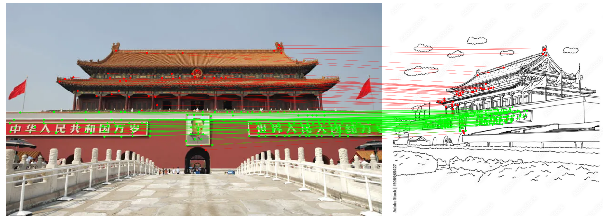

OpenCV DNN extension (zzcvdnn)
==============================

**zzcvdnn** is a C++ library that extend OpenCV DNN module.

# Modules

## Feature Detector & Descriptors

- [x] [SuperPoint](https://github.com/magicleap/SuperPointPretrainedNetwork), CVPRW 2018
- [x] [DISK](https://github.com/cvlab-epfl/disk), NeurIPS 2020
- [ ] [SGMNet](https://github.com/vdvchen/SGMNet), ICCV 2021
- [ ] [LoFTR](https://github.com/zju3dv/LoFTR), CVPR 2021
- [x] [LANet](https://github.com/wangch-g/lanet), ACCV 2022
- [x] [ALIKE](https://github.com/Shiaoming/ALIKE), ArXiv 2022
- [ ] [ALIKED](https://github.com/Shiaoming/ALIKED), ArXiv 2023: Use deformable convolution
- [ ] [silk](https://github.com/facebookresearch/silk), ArXiv 2023
- [x] [DeDoDe 🎶](https://github.com/Parskatt/DeDoDe), ArXiv 2023

## Dense

- [ ] [DenseMatching](https://github.com/PruneTruong/DenseMatching)
- [ ] [RoRD](https://github.com/UditSinghParihar/RoRD), IROS 2021
- [ ] [DKM](https://github.com/Parskatt/DKM), CVPR 2023
- [ ] [Roma](https://github.com/Parskatt/RoMa), Arxiv 2023

## Matching

- [x] [NearestNeighborMatcher](https://kornia.readthedocs.io/en/latest/feature.html#kornia.feature.match_smnn)
- [x] [DualSoftMaxMatcher](https://github.com/Parskatt/DeDoDe/blob/main/DeDoDe/utils.py)
- [x] [SuperGlue](https://github.com/magicleap/SuperGluePretrainedNetwork), CVPR 2020
- [x] [LightGlue](https://github.com/cvg/LightGlue), ICCV 2023

## References

- https://github.com/Vincentqyw/image-matching-webui
- https://github.com/ericzzj1989/Awesome-Image-Matching

## Examples

