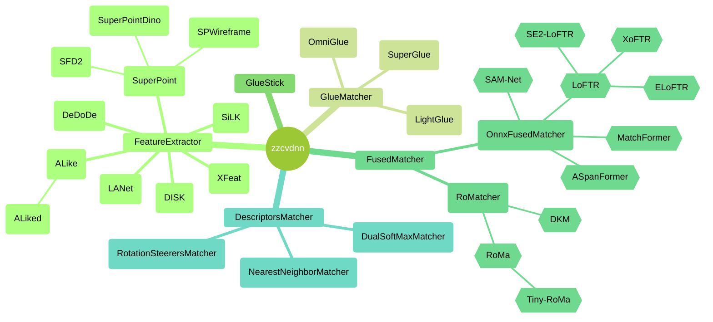
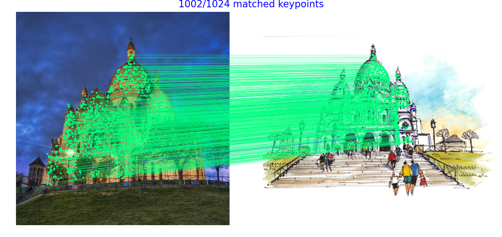
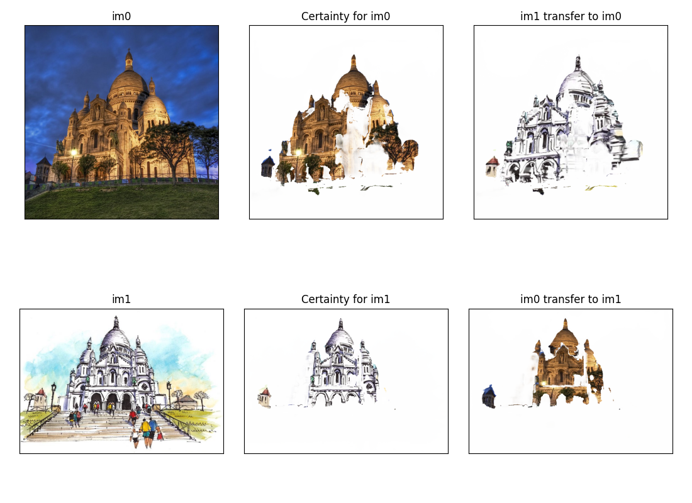

OpenCV DNN extension (zzcvdnn)
==============================

**zzcvdnn** is a C++ library that extend OpenCV DNN module to do **keypoint detection**, **descriptor extraction** and **matching**.

# Modules

## Feature Detector & Descriptors

- [x] [SuperPoint](https://github.com/magicleap/SuperPointPretrainedNetwork), CVPRW 2018
- [x] [DISK](https://github.com/cvlab-epfl/disk), NeurIPS 2020
- [ ] [SGMNet](https://github.com/vdvchen/SGMNet), ICCV 2021
- [x] [LANet](https://github.com/wangch-g/lanet), ACCV 2022
- [x] [ALIKE](https://github.com/Shiaoming/ALIKE), TMM 2022
- [x] [ALIKED](https://github.com/Shiaoming/ALIKED), ArXiv 2023: Use deformable convolution
- [x] [SFD2](https://github.com/feixue94/sfd2), CVPR 2023: Use SuperPoint class & NN Matcher
- [x] [silk](https://github.com/facebookresearch/silk), ArXiv 2023: Fused BN and Conv
- [x] [DeDoDe 🎶](https://github.com/Parskatt/DeDoDe), 3DV 2024
- [x] [Steerers](https://github.com/georg-bn/rotation-steerers), arXiv 2023: Based on DeDoDe
- [x] [XFeat](https://github.com/verlab/accelerated_features), CVPR 2024: Fused Linear and BN
- [x] [XFeat-Steerers](https://colab.research.google.com/drive/1ZFifMqUAOQhky1197-WAquEV1K-LhDYP?usp=sharing#scrollTo=Pj0MmCVajo3f)
- [ ] [affine-steerers](https://github.com/georg-bn/affine-steerers), ECCV 2024

## Semi-Dense

- [ ] [Patch2Pix](https://github.com/GrumpyZhou/patch2pix), CVPR 2021
- [x] [LoFTR](https://github.com/zju3dv/LoFTR), CVPR 2021: Use gim weights
- [x] [SE2-LoFTR](https://github.com/georg-bn/se2-loftr), CVPRW 2022: Use [e2cnn](https://github.com/QUVA-Lab/e2cnn)
- [x] [ASpanFormer](https://github.com/apple/ml-aspanformer), ECCV 2022
- [x] [MatchFormer](https://github.com/jamycheung/MatchFormer), ACCV 2022
- [ ] [TopicFM](https://github.com/TruongKhang/TopicFM/tree/aaai23_ver), AAAI 2023
- [ ] [TopicFM+](https://github.com/TruongKhang/TopicFM), arXiv 2023
- [ ] [AdaMatcher](https://github.com/TencentYoutuResearch/AdaMatcher), CVPR 2023
- [x] [Efficient LoFTR](https://github.com/zju3dv/EfficientLoFTR), CVPR 2024
- [x] [XoFTR](https://github.com/OnderT/XoFTR), CVPR 2024
- [x] [SAM-Net](https://github.com/benjaminkelenyi/SAM-Net), [ESWA 2023](https://www.sciencedirect.com/science/article/abs/pii/S0957417423033067#fn1)

## Dense

- [ ] [DenseMatching](https://github.com/PruneTruong/DenseMatching)
- [ ] [RoRD](https://github.com/UditSinghParihar/RoRD), IROS 2021
- [x] [DKM](https://github.com/Parskatt/DKM), CVPR 2023: Use `torch.linalg.inv`
- [x] [Roma&TinyRoma](https://github.com/Parskatt/RoMa), CVPR 2024: Use `torch.linalg.inv`

## Matching

- [x] [NearestNeighborMatcher](https://kornia.readthedocs.io/en/latest/feature.html#kornia.feature.match_smnn)
- [x] [DualSoftMaxMatcher](https://github.com/Parskatt/DeDoDe/blob/main/DeDoDe/utils.py)
- [x] [SuperGlue](https://github.com/magicleap/SuperGluePretrainedNetwork), CVPR 2020
- [x] [LightGlue](https://github.com/cvg/LightGlue), ICCV 2023
- [x] [GlueStick](https://github.com/cvg/GlueStick), ICCV 2023
- [x] [OmniGlue](https://github.com/google-research/omniglue), CVPR 2024
- [ ] [SphereGlue](https://github.com/vishalsharbidar/SphereGlue), CVPRW 2023

## 3D

- [ ] [dust3r](https://github.com/naver/dust3r)
- [ ] [mast3r](https://github.com/naver/mast3r)

## Framework

- [x] [glue-factory](https://github.com/cvg/glue-factory)
- [x] [gim](https://github.com/xuelunshen/gim), ICLR 2024: LoFTR, LightGlue, DKM, RoMa
- [x] [MINIMA](https://github.com/LSXI7/MINIMA), Arvix 2024

## References

- https://github.com/Vincentqyw/image-matching-webui
- https://github.com/alexstoken/image-matching-models
- https://github.com/GrumpyZhou/image-matching-toolbox
- https://github.com/Vincentqyw/LineSegmentsDetection
- https://github.com/3DOM-FBK/deep-image-matching
- https://github.com/ericzzj1989/Awesome-Image-Matching
- https://github.com/chicleee/Image-Matching-Paper-List

## Blog

- https://vincentqin.tech/posts/superglue/
- https://iago-suarez.com/gluestick/

## Image Matching Challenge
- [2019](https://image-matching-workshop.github.io/leaderboard)
- [2020](https://www.cs.ubc.ca/research/image-matching-challenge/2020)
- [2021](https://www.cs.ubc.ca/research/image-matching-challenge/2021), [Kaggle](https://www.kaggle.com/competitions/image-matching-challenge-2022)
- [2022](https://www.kaggle.com/competitions/image-matching-challenge-2022)
- [2023](https://www.kaggle.com/competitions/image-matching-challenge-2023)
- [2024](https://www.kaggle.com/competitions/image-matching-challenge-2024)

## Classes

## Examples

Images examples

